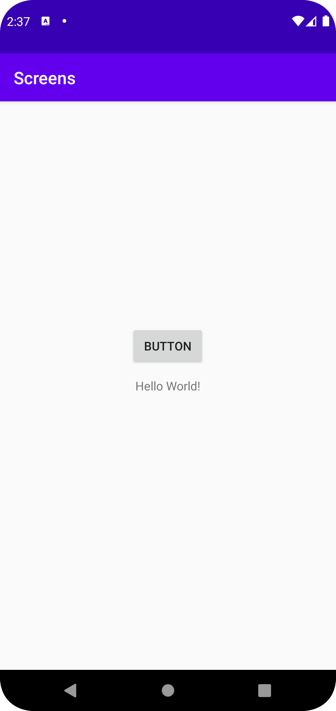
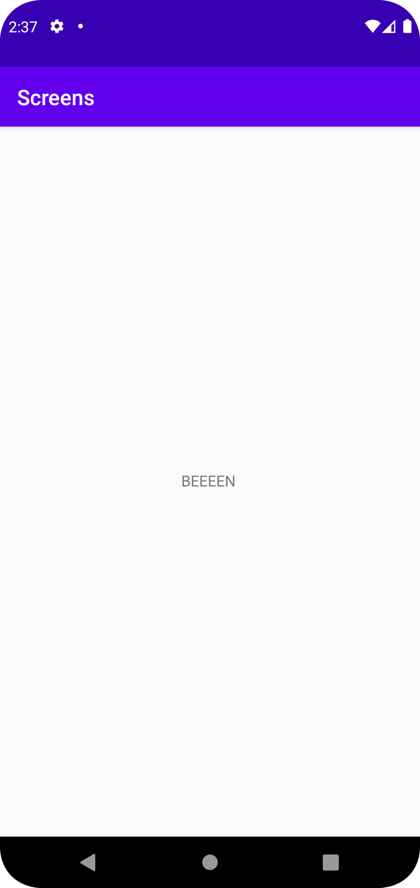

Först lade jag till en ny activity (acitiviy_main2), sedan lade till en
knapp i activity_main, sedan gav jag knappen en intent och setOnClickListener
(kolla på koden 1.), sedan en intent med namneet "BEEEEN", och en textView
widget för att visa "namn" och på activity_main2 lades det till en findViewById 
och getString för att ta emot intenten samt widgeten och visa upp den. 

```
        1. Button b = findViewById(R.id.button);

        b.setOnClickListener(new View.OnClickListener() {
            @Override
            public void onClick(View view) {
                Log.d("==>","RRRRRRAH");
                Intent intent = new Intent(MainActivity.this, MainActivity2.class);
                intent.putExtra("name", "BEEEEN"); // Optional
                startActivity(intent);
            }
        });
        
        2. Bundle extras = getIntent().getExtras();
        if (extras != null) {
            String name = extras.getString("name");
            Log.d("==>", name);
            TextView texten = findViewById(R.id.textView);
            texten.setText(name);
```


